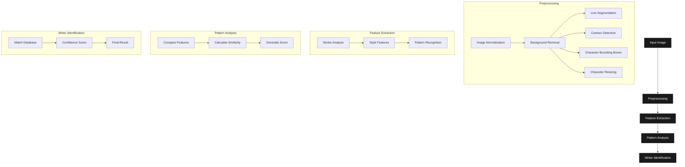

# HandwritingRecognition ✍️

An Intelligent system for identifying the writer based on the handwriting patterns and characteristics.

## Overview 🎯
The system analyzes unique writing patterns and characteristics to determine the identity of the writer. Using advanced machine learning techniques, it can recognize individual writing styles and authenticate the author of handwritten text.

## System Architecture 🏗️


## Features 🌟
- Writer identification from handwritten samples
- Pattern analysis of writing style
- Support for different writing formats
- High accuracy identification

## Requirements 🔧
- Python 3.12
- Required Python packages (install via pip):
  - TensorFlow
  - OpenCV
  - NumPy
  - scikit-learn

## Installation 🛠️
```bash
git clone https://github.com/yourusername/HandwritingRecognition.git
cd HandwritingRecognition
```

## License 📝
This project is licensed under the MIT License.

```
MIT License

Copyright (c) 2024 Tecson Gacrama, Yuanpeng Zhong

Permission is hereby granted, free of charge, to any person obtaining a copy of this software and associated documentation files (the "Software"), to deal in the Software without restriction, including without limitation the rights to use, copy, modify, merge, publish, distribute, sublicense, and/or sell copies of the Software, and to permit persons to whom the Software is furnished to do so, subject to the following conditions:

The above copyright notice and this permission notice shall be included in all copies or substantial portions of the Software. THE SOFTWARE IS PROVIDED "AS IS", WITHOUT WARRANTY OF ANY KIND, EXPRESS OR IMPLIED, INCLUDING BUT NOT LIMITED TO THE WARRANTIES OF MERCHANTABILITY, FITNESS FOR A PARTICULAR PURPOSE AND NONINFRINGEMENT. IN NO EVENT SHALL THE AUTHORS OR COPYRIGHT HOLDERS BE LIABLE FOR ANY CLAIM, DAMAGES OR OTHER LIABILITY, WHETHER IN AN ACTION OF CONTRACT, TORT OR OTHERWISE, ARISING FROM, OUT OF OR IN CONNECTION WITH THE SOFTWARE OR THE USE OR OTHER DEALINGS IN THE SOFTWARE.
```

## Team 👥
- Co-Developer: Tecson Gacrama
- Co-Developer: Yuanpeng Zhong
